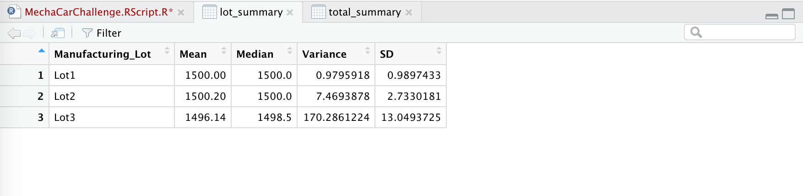

# MechaCar_Statistical_Analysis

## Linear Regression to Predict MPG
**Which variables/coefficients provided a non-random amount of variance to the mpg values in the dataset?**

Vehicle length and ground clearance are the only two variables to have moderate non-random amount of variance to the mpg value. The variables that had the most amount of random variance are vehicle weight, spoiler angle, and AWD.

**Is the slope of the linear model considered to be zero? Why or why not?**
Our slope is not zero because the p-value: 5.35e-11, is less than 0.05 which means we can reject the null hypothesis that our coefficient is equal to zero. Conversely, if it was higher than 0.05, we would not be able to reject the null hypothesis and it would mean that our data would not be a predictor in association with MPG. 

**Does this linear model predict mpg of MechaCar prototypes effectively? Why or why not?**

Our R-squared value is 71.5%, which means roughly ~71% of the time the model will predict MPG values correctly. There are probably outside factors that are not captured in the current datasaet that contribute to the mpg variability of the MechaCar prototypes. The current dataset could also need a more robust sample in order to have a higher probabily of being accurate. 

### Screenshot of Summary Below

## Summary Statistics on Suspension Coils

**The design specifications for the MechaCar suspension coils dictate that the variance of the suspension coils must not exceed 100 pounds per square inch. Does the current manufacturing data meet this design specification for all manufacturing lots in total and each lot individually? Why or why not?**

Lot 1 and Lot 2 are both within design specifications, since they are both far below the 100 variance of the suspension coils at 0.98 and 7.47 respectively. Lot 3 shows the highest variance at over 170 and exceeds the manufacturers specifications of over 100 pounds per square inch.

### Screenshot of Total Summary Below

### Screenshot of Lot Summary Below

## T-Tests on Suspension Coils

For the total summary, Lot 1 and Lot 2, the PSI values are different from the population mean of 1500 because they have a p-value of over .05. However; for lot 3 the p-value is under 0.05 at 0.042 which means there is evidence that the suspension coil is different from the 1500 population mean. 

### Screenshot of Total Below

### Screenshot of Lot 1 Below

### Screenshot of Lot 2 Below

### Screenshot of Lot 3 Below

